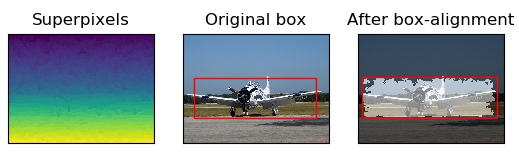
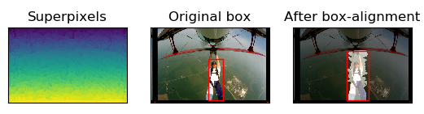
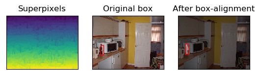
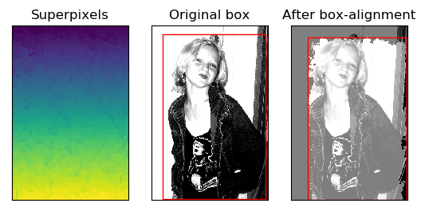
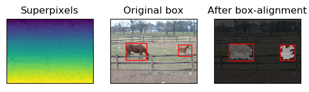

# :construction: WIP :construction:
# Bbox Refine

**Todo**
- [x] Box alignment
- [x] Multi-thresholding superpixel merging
- [ ] Quantitative Metric evaluation

# Requirements
- Ubuntu
- Python 3
- Chainer
- ChainerCV

# Usage
- Clone the repository
```bash
$ git clone https://github.com/kvmanohar22/bbox-refine.git
$ git submodule init
$ git submodule update
```
- Build the superpixels repo
```bash
$ cd external/superpixels-revisited
```
Follow the instructions from [here](https://github.com/davidstutz/superpixels-revisited.git)

- Run the demo script
```bash
$ cd scripts
$ ./demo.sh
```

# Experimental Results
Some qualitative results after applying bbox-alignment step, (quantitative coming soon...)
<figure>
  
</figure>

<figure>
  
</figure>

<figure>
  
</figure>

<figure>
  
</figure>

<figure>
  
</figure>

# References
[1] **Boundary-Aware Box Refinement for Object Proposal Generation**\
Xiaozhi Chen, Huimin Ma, Chenzhuo Zhu, Xiang Wang, Zhichen Zhao\
Neurocomputing, 2017