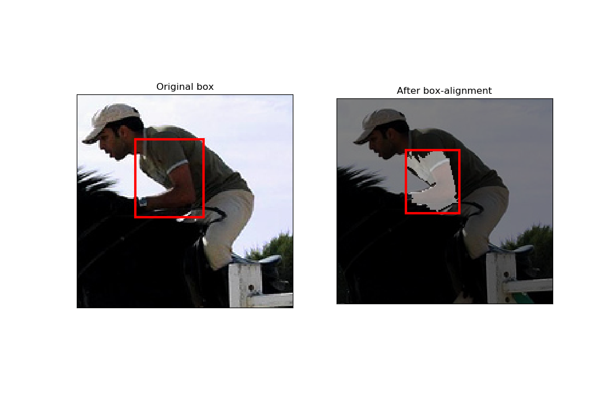

# :construction: WIP :construction:
# Bbox Refine

**Todo**
- [x] Box alignment
- [ ] Multi-thresholding superpixel merging
- [ ] Quantitative Metric evaluation

# Requirements
- Ubuntu
- Python 3
- Chainer
- ChainerCV

# Expeimental Results
<figure>
    
    <figcaption>Result after box alignment</figcaption>
</figure>

